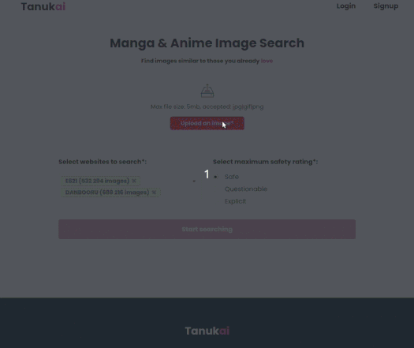

# Tanukai

This project creates an index of art images (mainly Japanese manga/anime-style drawings) so that you can find similar images to these stored images by uploading your own image. Basically: reverse image search for manga/anime.
Available on https://tanukai.com

### Implementation details
In order to store the image so that it can be used for reverse-searching, Tanukai uses two methods:
* Convoluted Neural Network (DenseNet121) - it uses a pre-trained CNN to infer the features of the image (it gets the features vector from the second-to-last output layer of the CNN). This features vector is stored in Milvus - vector similarity search engine (https://milvus.io/). Additional image data is stored in Elasticsearch (including its path, timestamp and metadata such as tags, author etc).
When a user uploads an image to search for similar images, Tanukai gets the features of the uploaded image using the CNN, then it makes the similarity search query using these features in Milvus, and then makes a query to Elasticsearch to get data about the received results.
Tanukai uses DenseNet121 as it's pretty fast, has a small vector (1024) and returns proper results for anime images.
* Perceptual Hash (pHash) - Tanukai calculates the pHash of images and stores it in Elasticsearch (every character of the hash is stored in a separate keyword-type element in ES to leverage Lucene's capabilities). When someone wants to find similar images, it calculates the pHash of the uploaded image, makes a ES query to find images with `minimum_should_match` elements of the pHash. This is mostly useful when searching for almost identical images and is not currently used (only stored in ES).

Other features:
* REST back-end made in Django REST Framework
* Scrapy is used to scrape images from image-boards such as Danbooru that are then processed by the CNN and stored in Milvus and ES.
* OpenCV is used for template matching (to show the found sub-image in a large image, currently not used)
* Database (MySQL) along with Django's ORM is used to store user data, user settings (prefered art websites/safety rating) and previous searches
* React front-end (extremely basic, my React skills are lacking)
* Containerized using docker-compose

Libraries used: 
* Backend: Keras, elasticsearch-dsl, Pillow, ImageHash, OpenCV, Django (DRF), Scrapy
* Frontend: React, Redux, React-Semantic-UI

Directories description:
* home - Django start directory
* img_match - reverse image search "library"
* nginx - nginx settings
* node_modules - node packages
* public - directory used by React to generate some front-end stuff
* scrapers - Scrapy-based scrapers that fetch and save images
* src - front-end
* static - directory containing images and other static files
* tanukai - Tanukai Django files

### Starting the project
* Install docker and docker-compose
* Copy `.env.dist` to `.env` (and change some variables if necessary, especially `REACT_APP_API_URL` - this should be the address to the Django API)
* Execute `docker-compose build`
* Execute `docker-compose up -d` (or `docker-compose -f docker-compose.prod.yml up -d` in deployment environment)
* Create and apply migrations by using `docker-compose exec image_search_python python manage.py makemigrations && docker-compose exec image_search_python python manage.py migrate` (on production, use `docker-compose -f docker-compose.prod.yml exec image_search_python python manage.py makemigrations --settings=home.settings.prod && docker-compose -f docker-compose.prod.yml exec image_search_python python manage.py migrate --settings=home.settings.prod`)
* The front-end should be available on the port specified in `DOCKER_WEB_PORT` .env variable. More details can be found in the `nginx/nginx.confg` file.

### Testing
Coming soon

### TODOs
- [ ] Create tests (pytest + mock databases; Selenium front-end tests)
- [ ] Cleanup code, add linters
- [X] Add MySQL support instead of sqlite
- [ ] Use AWS S3 to store images
- [ ] Add FAQ section, terms, etc
- [X] Improve the front-end look
- [ ] Add UserTags functionality (white/blacklisting of tags)
- [ ] Add more searching methods (search by tags and sort by the score returned by ES)
